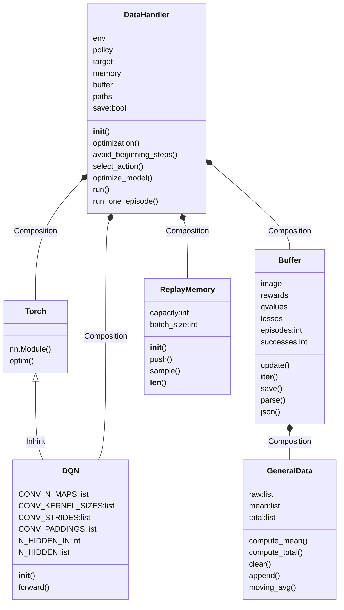

# dqn Class diagram

---
Title : oop-proj-dqn-pacman
---

```mermaid
classDiagram
    Torch <|-- DQN:Inhirit
    DataHandler *-- Torch:Composition
    DataHandler *-- DQN:Composition
    DataHandler *-- Buffer:Composition
    DataHandler *-- ReplayMemory:Composition
    Buffer *-- GeneralData:Composition

    class DataHandler{
        env
        policy
        target
        memory
        buffer
        paths
        save:bool

        __init__()
        optimization()
        avoid_beginning_steps()
        select_action()
        optimize_model()
        run()
        run_one_episode()
    }
    class GeneralData{
        raw:list
        mean:list
        total:list

        compute_mean()
        compute_total()
        clear()
        append()
        moving_avg()
    }
    class Buffer{
        image
        rewards
        qvalues
        losses
        episodes:int
        successes:int

        update()
        __iter__()
        save()
        parse()
        json()
    }
    class ReplayMemory{
        capacity:int
        batch_size:int

        __init__()
        push()
        sample()
        __len__()
    }
    class DQN{
        CONV_N_MAPS:list
        CONV_KERNEL_SIZES:list
        CONV_STRIDES:list
        CONV_PADDINGS:list
        N_HIDDEN_IN:int
        N_HIDDEN:list

        __init__()
        forward()
    }
    class Torch{
        nn.Module()
        optim()
    }
```